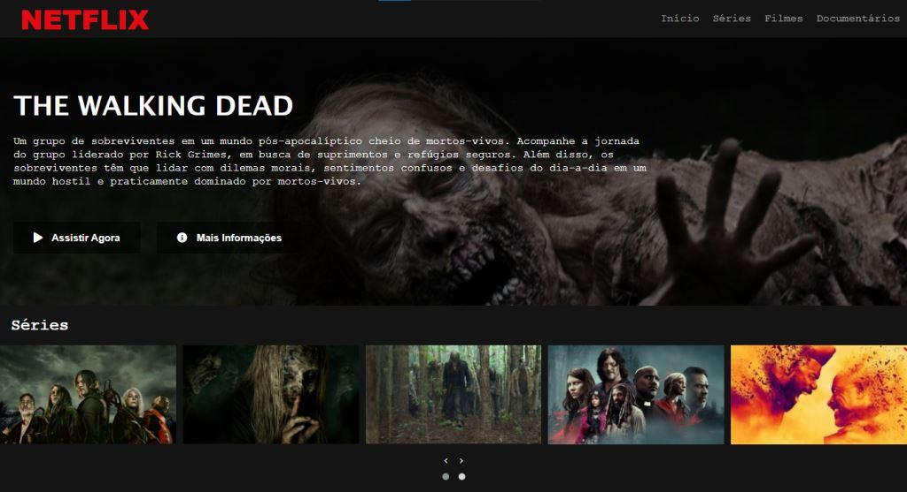
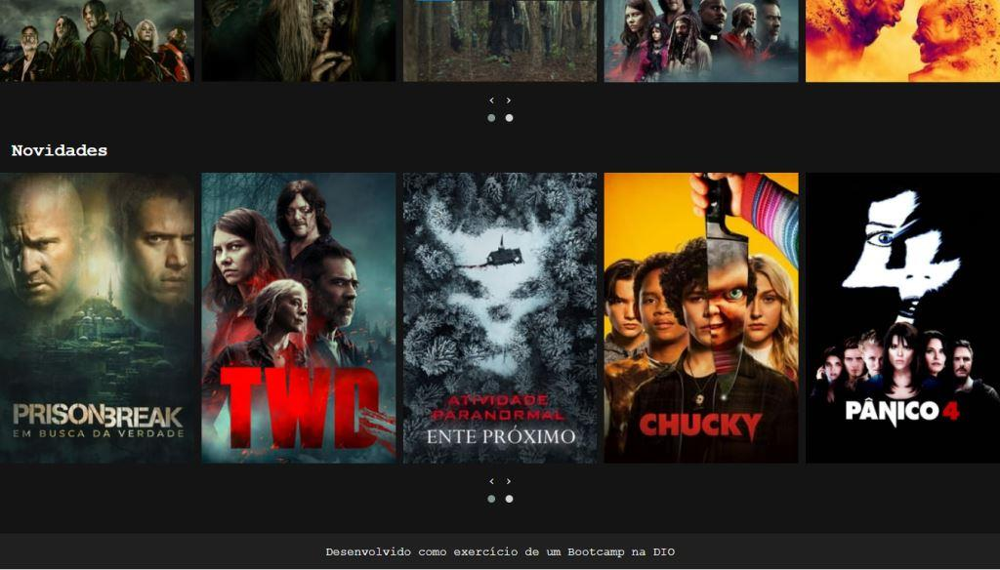

## Exercícios de Cursos e Bootcamps feitos na Digital Innovation One - DIO
> https://www.dio.me/

### Descrição dos projetos e exercícios deste repositório:

## Abstraindo um Bootcamp:
Implementação de classes que descrevem um bootcamp, com cursos, alunos e mentorias. 
Usando a linguagem **Java** e os conceitos de **Programação Orientada à Objetos.**

## Banco Digital:
Simulação de um Banco, com classes que representam Contas, Clientes e Banco. 
Usando a linguagem **Java** e os conceitos de **Programação Orientada à Objetos.**

## Instagram Clone
Página que simula a tela de continuação de Login do Instagram.
Com layout responsivo. Utilizando HTML5 e CSS3.

##### Página no Smartphone:

##### Página no Desktop:

------

## Jogo de Naves
Jogo de Naves e resgate de reféns. Utilizando HTML5, CSS3, JavaScript e JQuery.

##### Início:

##### Jogo iniciado:

##### Restando 2 vidas:

------

## Jogo Genius

------

## Netflix Clone
Clone de uma Página inicial da Netflix.

Página inicial:

------

